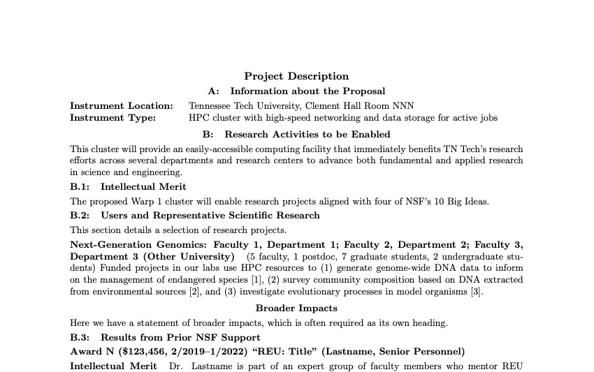

# nsf-proposal: Basic LaTeX2e documentclass for NSF proposals

Mike Renfro (GitHub/Twitter: @mikerenfro)

This needs better documentation, but for now, this documentclass lets you make
relatively compact NSF proposals with a minimum of fiddly ad hoc formatting
inside the main document.
We've used this documentclass for both an MRI and a CC* proposal this year.

It uses the memoir class as its base, and supports proposals with a base font
size of 10 points and higher.
It adds a small amount of whitespace around lines at 10pt, since NSF's PDF
readers will often flag a 10pt document as having more than 6 lines per inch.
We also noticed that luatex creates a slightly different line height than
pdftex, so if you're using Overleaf, you may want to set the default engine
to pdflatex, or if you find a better solution that works with both engines,
send me a pull request.

It loads the following packages on its own:

- enumitem (including inline lists)
- booktabs (with a reduced value for `\tabcolsep`)
- array (including a ragged right paragraph column type)
- multicol
- siunitx (including binary units)
- graphicx
- hyperref
- cleveref

It disables most, if not all, of the hyperlinks in the main body of the
proposal, leaving hyperlinks active in the references.

As shown in the example document, you can use a `\chapter*` and `\section*`
for the 1-page Project Summary, `\chapter`, `\section`, `\subsection`,
`\subsubsection`, and `\paragraph` commands as needed in the Project
Description, where the subsubsection and paragraph levels are unnumbered
by default.

The documentclass code is only about 120 lines, including whitespace and
comments, so it should be relatively readable.
Example files include:

- nsf-demo.tex
- nsf-demo.bib
- nsf-demo-{10,11,12}pt-{description,references,summary}.pdf

The PDFs can be uploaded to [research.gov](https://research.gov/) on a test
project, and they shouldn't throw any warnings as provided.
Larger font sizes may trigger hyphenation problems for some words, so be sure
to add hyphenation as necessary (already done for the `hurt2021` reference in
nsf-demo.bib).
