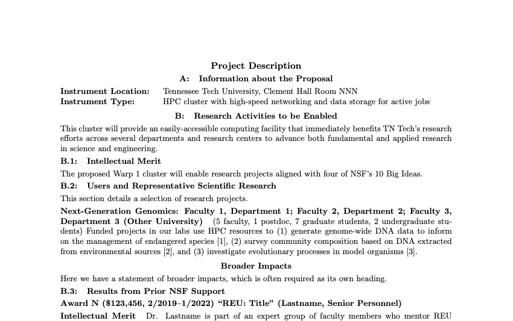

# nsf-proposal: Basic LaTeX2e documentclass for NSF proposals

Mike Renfro (GitHub/Twitter: @mikerenfro)

This needs better documentation, but for now, this documentclass lets you make
relatively compact NSF proposals with a minimum of fiddly ad hoc formatting
inside the main document.
We've used this documentclass for both an MRI and a CC* proposal this year.

It uses the memoir class as its base, and supports proposals with a base font
size of 10 points and higher.
It adds a small amount of whitespace around lines at 10pt, since NSF's PDF
readers will often flag a 10pt document as having more than 6 lines per inch.
We also noticed that LuaTeX creates a slightly different line height than
pdfTeX, so if you're using Overleaf, you may want to set the default engine
to pdfLaTeX, or if you find a better solution that works with both engines,
send me a pull request.

It disables most, if not all, of the hyperlinks in the main body of the
proposal, leaving hyperlinks active in the references.

The documentclass code is only about 100 lines, including whitespace and
comments, so it should be relatively readable.
Sample source files for a proposal can be found in:

- nsf-demo.tex
- nsf-demo.bib

And the split PDF output from the sample document can be found in three
different font sizes in:

- [nsf-demo-10pt-summary.pdf](sample-output/nsf-demo-10pt-summary.pdf)
- [nsf-demo-10pt-description.pdf](sample-output/nsf-demo-10pt-description.pdf)
- [nsf-demo-10pt-references.pdf](sample-output/nsf-demo-10pt-references.pdf)
- [nsf-demo-11pt-summary.pdf](sample-output/nsf-demo-11pt-summary.pdf)
- [nsf-demo-11pt-description.pdf](sample-output/nsf-demo-11pt-description.pdf)
- [nsf-demo-11pt-references.pdf](sample-output/nsf-demo-11pt-references.pdf)
- [nsf-demo-12pt-summary.pdf](sample-output/nsf-demo-12pt-summary.pdf)
- [nsf-demo-12pt-description.pdf](sample-output/nsf-demo-12pt-description.pdf)
- [nsf-demo-12pt-references.pdf](sample-output/nsf-demo-12pt-references.pdf)

These PDFs can be uploaded to [research.gov](https://research.gov/) on a test
project, and they shouldn't throw any warnings as provided.

The sample document adds the following packages not specifically required by
NSF, but really handy for these sorts of proposals:

- [enumitem](https://ctan.org/pkg/enumitem) (including inline lists)
- [booktabs](https://ctan.org/pkg/booktabs) (with a reduced value for `\tabcolsep`)
- [array](https://ctan.org/pkg/array) (including a ragged right paragraph column type `P`)
- [multicol](https://ctan.org/pkg/multicol)
- [siunitx](https://ctan.org/pkg/siunitx) (including binary units)
- [graphicx](https://ctan.org/pkg/graphicx)
- [hyperref](https://ctan.org/pkg/hyperref)
- [cleveref](https://ctan.org/pkg/cleveref)

As shown in the sample document, you can use a `\chapter*` and `\section*`
for the 1-page Project Summary, `\chapter`, `\section`, `\subsection`,
`\subsubsection`, and `\paragraph` commands as needed in the Project
Description, where the subsubsection and paragraph levels are unnumbered
by default.

Larger font sizes may trigger hyphenation problems for some words and drive
some lines into the right margin, so be sure to add hyphenation as necessary
(already done for the `hurt2021` reference in nsf-demo.bib).

We also made a basic Gantt chart for one of the proposals. It uses
[`pgfgantt`](https://ctan.org/pkg/pgfgantt), with just a bit of abuse to let
us have additional columns for which team member bears primary responsibility
or secondary responsibility. You'll find its source and output in the
`images/` folder.

