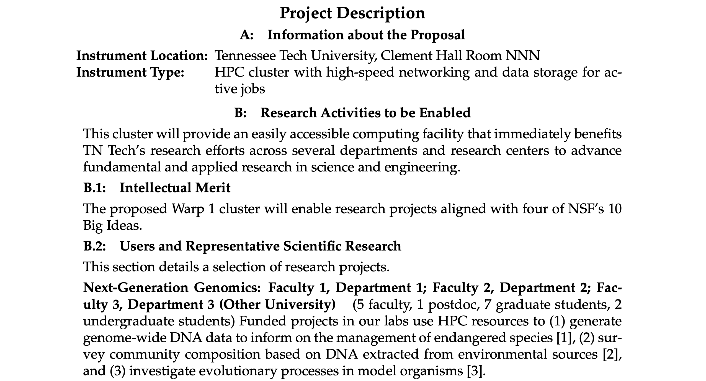
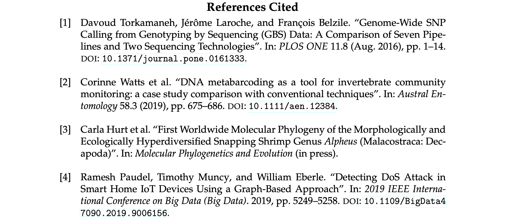
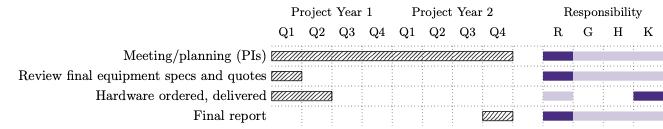

# nsf-proposal: Basic LaTeX2e documentclass for NSF proposals

Mike Renfro (GitHub/Twitter: @mikerenfro)

This needs better documentation, but for now, this documentclass lets you make
relatively compact NSF proposals with a minimum of fiddly ad hoc formatting
inside the main document.
We've used this documentclass for both an MRI and a CC* proposal in 2021, and
it's just been recently been verified for the 2024 PAPPG standards (as far as
I know).

## TL;DR

`\documentclass[fontsize,basefont]{nsf-proposal}` where `fontsize` is `10pt`, `11pt`, or
`12pt`, and `basefont` is any of:

 - `arial`
 - `cm` (the default)
 - `courier-new`
 - `helvetica`
 - `palatino`
 - `palatino-linotype` (may only work by default on Windows)
 - `times-new-roman`

Optionally, add the `tg` class option to use the TeX Gyre equivalents to Courier
New, Helvetica, Palatino, or Times New Roman.

Now write the rest of your proposal, using `\chapter` on down to `\paragraph`
to break things up. You'll want to use the starred versions of these on the
one-page project summary. See [`nsf-demo.tex`](https://github.com/mikerenfro/nsf-proposal/blob/main/nsf-demo.tex) and [`nsf-demo-content.tex`](https://github.com/mikerenfro/nsf-proposal/blob/main/nsf-demo-content.tex) for an example.

## More Details

This documentclass uses the [memoir](https://ctan.org/pkg/memoir) class as its base, and supports proposals
with a base font size of 10 points and higher (for the `arial`, `courier-new`,
`helvetica`, `palatino`, and `palatino-linotype` options), or 11 points and higher (for the `cm`
and `times-new-roman` options).
It adds a small amount of whitespace around lines at 10pt, since NSF's PDF
readers will often flag a 10pt document as having more than 6 lines per inch.
We also noticed that LuaLaTeX creates a slightly different line height than
pdfLaTeX, so if you're using Overleaf, you may want to set the default engine
to pdfLaTeX, or if you find a better solution that works with both engines,
send me a pull request.

It disables most, if not all, of the hyperlinks in the main body of the
proposal, leaving hyperlinks active in the references.

The documentclass code is around 300 lines, including whitespace and
comments, so it should be relatively readable (over half of that is
for handling different base fonts and sizes).
The documentclass depends on the following packages:

- [`fontspec`](http://ctan.org/pkg/fontspec) (if using LuaLaTeX or XeLaTeX)
- [`helvet`](https://ctan.org/pkg/helvet) (for option `helvetica`)
- [`hyperref`](https://ctan.org/pkg/hyperref)
- [`iftex`](https://ctan.org/pkg/hyperref)
- [`mathpazo`](https://ctan.org/pkg/mathpazo) (for option `palatino` and `palatino-linotype`)
- [`sansmath`](https://ctan.org/pkg/sansmath) (for option `arial` and `helvetica`)
- [`xstring`](https://ctan.org/pkg/xstring)

Sample source files for a proposal can be found in:

- [`nsf-demo.tex`](https://github.com/mikerenfro/nsf-proposal/blob/main/nsf-demo.tex)
- [`nsf-demo-content.tex`](https://github.com/mikerenfro/nsf-proposal/blob/main/nsf-demo-content.tex)
- [`nsf-demo.bib`](https://github.com/mikerenfro/nsf-proposal/blob/main/nsf-demo.bib)

### Sample Output

The following table is grouped by base font, latex engine, and font size.
The "S", "D", and "R" PDFs represent the one-page
summary, the <=15-page project description, and the references/bibliography for a sample
NSF proposal. These PDFs can be uploaded to [research.gov](https://research.gov/)
on a test project, and they shouldn't throw any warnings as provided.
The "C" PDFs are a combined document including the summary, description, and references.
Any N/A entries represent either an impossible combination of font and engine
(e.g., Arial and pdflatex), or an invalid combination of font and size per
the NSF PAPPG (e.g., Computer Modern at 10 pt).
| Engine:      | pdf*       | pdf*       | pdf*       | xe*        | xe*        | xe*        | lua*       | lua*       | lua*       |
| -----------: | :--------: | :--------: | :--------: | :--------: | :--------: | :--------: | :--------: | :--------: | :--------: |
| **Font**     | 10&nbsp;pt | 11&nbsp;pt | 12&nbsp;pt | 10&nbsp;pt | 11&nbsp;pt | 12&nbsp;pt | 10&nbsp;pt | 11&nbsp;pt | 12&nbsp;pt |
| Arial |  N/A |  N/A |  N/A | [S](sample-output/arial/arial-pdfxe-10pt-summary.pdf) [D](sample-output/arial/arial-pdfxe-10pt-description.pdf) [R](sample-output/arial/arial-pdfxe-10pt-references.pdf) [C](sample-output/arial/arial-pdfxe-10pt.pdf) | [S](sample-output/arial/arial-pdfxe-11pt-summary.pdf) [D](sample-output/arial/arial-pdfxe-11pt-description.pdf) [R](sample-output/arial/arial-pdfxe-11pt-references.pdf) [C](sample-output/arial/arial-pdfxe-11pt.pdf) | [S](sample-output/arial/arial-pdfxe-12pt-summary.pdf) [D](sample-output/arial/arial-pdfxe-12pt-description.pdf) [R](sample-output/arial/arial-pdfxe-12pt-references.pdf) [C](sample-output/arial/arial-pdfxe-12pt.pdf) | [S](sample-output/arial/arial-pdflua-10pt-summary.pdf) [D](sample-output/arial/arial-pdflua-10pt-description.pdf) [R](sample-output/arial/arial-pdflua-10pt-references.pdf) [C](sample-output/arial/arial-pdflua-10pt.pdf) | [S](sample-output/arial/arial-pdflua-11pt-summary.pdf) [D](sample-output/arial/arial-pdflua-11pt-description.pdf) [R](sample-output/arial/arial-pdflua-11pt-references.pdf) [C](sample-output/arial/arial-pdflua-11pt.pdf) | [S](sample-output/arial/arial-pdflua-12pt-summary.pdf) [D](sample-output/arial/arial-pdflua-12pt-description.pdf) [R](sample-output/arial/arial-pdflua-12pt-references.pdf) [C](sample-output/arial/arial-pdflua-12pt.pdf) | 
| Computer Modern |  N/A | [S](sample-output/cm/cm-pdf-11pt-summary.pdf) [D](sample-output/cm/cm-pdf-11pt-description.pdf) [R](sample-output/cm/cm-pdf-11pt-references.pdf) [C](sample-output/cm/cm-pdf-11pt.pdf) | [S](sample-output/cm/cm-pdf-12pt-summary.pdf) [D](sample-output/cm/cm-pdf-12pt-description.pdf) [R](sample-output/cm/cm-pdf-12pt-references.pdf) [C](sample-output/cm/cm-pdf-12pt.pdf) |  N/A | [S](sample-output/cm/cm-pdfxe-11pt-summary.pdf) [D](sample-output/cm/cm-pdfxe-11pt-description.pdf) [R](sample-output/cm/cm-pdfxe-11pt-references.pdf) [C](sample-output/cm/cm-pdfxe-11pt.pdf) | [S](sample-output/cm/cm-pdfxe-12pt-summary.pdf) [D](sample-output/cm/cm-pdfxe-12pt-description.pdf) [R](sample-output/cm/cm-pdfxe-12pt-references.pdf) [C](sample-output/cm/cm-pdfxe-12pt.pdf) |  N/A | [S](sample-output/cm/cm-pdflua-11pt-summary.pdf) [D](sample-output/cm/cm-pdflua-11pt-description.pdf) [R](sample-output/cm/cm-pdflua-11pt-references.pdf) [C](sample-output/cm/cm-pdflua-11pt.pdf) | [S](sample-output/cm/cm-pdflua-12pt-summary.pdf) [D](sample-output/cm/cm-pdflua-12pt-description.pdf) [R](sample-output/cm/cm-pdflua-12pt-references.pdf) [C](sample-output/cm/cm-pdflua-12pt.pdf) | 
| Courier New |  N/A |  N/A |  N/A | [S](sample-output/courier-new/courier-new-pdfxe-10pt-summary.pdf) [D](sample-output/courier-new/courier-new-pdfxe-10pt-description.pdf) [R](sample-output/courier-new/courier-new-pdfxe-10pt-references.pdf) [C](sample-output/courier-new/courier-new-pdfxe-10pt.pdf) | [S](sample-output/courier-new/courier-new-pdfxe-11pt-summary.pdf) [D](sample-output/courier-new/courier-new-pdfxe-11pt-description.pdf) [R](sample-output/courier-new/courier-new-pdfxe-11pt-references.pdf) [C](sample-output/courier-new/courier-new-pdfxe-11pt.pdf) | [S](sample-output/courier-new/courier-new-pdfxe-12pt-summary.pdf) [D](sample-output/courier-new/courier-new-pdfxe-12pt-description.pdf) [R](sample-output/courier-new/courier-new-pdfxe-12pt-references.pdf) [C](sample-output/courier-new/courier-new-pdfxe-12pt.pdf) | [S](sample-output/courier-new/courier-new-pdflua-10pt-summary.pdf) [D](sample-output/courier-new/courier-new-pdflua-10pt-description.pdf) [R](sample-output/courier-new/courier-new-pdflua-10pt-references.pdf) [C](sample-output/courier-new/courier-new-pdflua-10pt.pdf) | [S](sample-output/courier-new/courier-new-pdflua-11pt-summary.pdf) [D](sample-output/courier-new/courier-new-pdflua-11pt-description.pdf) [R](sample-output/courier-new/courier-new-pdflua-11pt-references.pdf) [C](sample-output/courier-new/courier-new-pdflua-11pt.pdf) | [S](sample-output/courier-new/courier-new-pdflua-12pt-summary.pdf) [D](sample-output/courier-new/courier-new-pdflua-12pt-description.pdf) [R](sample-output/courier-new/courier-new-pdflua-12pt-references.pdf) [C](sample-output/courier-new/courier-new-pdflua-12pt.pdf) | 
| Courier New (TeX Gyre Cursor) |  N/A |  N/A |  N/A | [S](sample-output/courier-new/courier-new-pdfxe,tg-10pt-summary.pdf) [D](sample-output/courier-new/courier-new-pdfxe,tg-10pt-description.pdf) [R](sample-output/courier-new/courier-new-pdfxe,tg-10pt-references.pdf) [C](sample-output/courier-new/courier-new-pdfxe,tg-10pt.pdf) | [S](sample-output/courier-new/courier-new-pdfxe,tg-11pt-summary.pdf) [D](sample-output/courier-new/courier-new-pdfxe,tg-11pt-description.pdf) [R](sample-output/courier-new/courier-new-pdfxe,tg-11pt-references.pdf) [C](sample-output/courier-new/courier-new-pdfxe,tg-11pt.pdf) | [S](sample-output/courier-new/courier-new-pdfxe,tg-12pt-summary.pdf) [D](sample-output/courier-new/courier-new-pdfxe,tg-12pt-description.pdf) [R](sample-output/courier-new/courier-new-pdfxe,tg-12pt-references.pdf) [C](sample-output/courier-new/courier-new-pdfxe,tg-12pt.pdf) | [S](sample-output/courier-new/courier-new-pdflua,tg-10pt-summary.pdf) [D](sample-output/courier-new/courier-new-pdflua,tg-10pt-description.pdf) [R](sample-output/courier-new/courier-new-pdflua,tg-10pt-references.pdf) [C](sample-output/courier-new/courier-new-pdflua,tg-10pt.pdf) | [S](sample-output/courier-new/courier-new-pdflua,tg-11pt-summary.pdf) [D](sample-output/courier-new/courier-new-pdflua,tg-11pt-description.pdf) [R](sample-output/courier-new/courier-new-pdflua,tg-11pt-references.pdf) [C](sample-output/courier-new/courier-new-pdflua,tg-11pt.pdf) | [S](sample-output/courier-new/courier-new-pdflua,tg-12pt-summary.pdf) [D](sample-output/courier-new/courier-new-pdflua,tg-12pt-description.pdf) [R](sample-output/courier-new/courier-new-pdflua,tg-12pt-references.pdf) [C](sample-output/courier-new/courier-new-pdflua,tg-12pt.pdf) | 
| Helvetica | [S](sample-output/helvetica/helvetica-pdf-10pt-summary.pdf) [D](sample-output/helvetica/helvetica-pdf-10pt-description.pdf) [R](sample-output/helvetica/helvetica-pdf-10pt-references.pdf) [C](sample-output/helvetica/helvetica-pdf-10pt.pdf) | [S](sample-output/helvetica/helvetica-pdf-11pt-summary.pdf) [D](sample-output/helvetica/helvetica-pdf-11pt-description.pdf) [R](sample-output/helvetica/helvetica-pdf-11pt-references.pdf) [C](sample-output/helvetica/helvetica-pdf-11pt.pdf) | [S](sample-output/helvetica/helvetica-pdf-12pt-summary.pdf) [D](sample-output/helvetica/helvetica-pdf-12pt-description.pdf) [R](sample-output/helvetica/helvetica-pdf-12pt-references.pdf) [C](sample-output/helvetica/helvetica-pdf-12pt.pdf) | [S](sample-output/helvetica/helvetica-pdfxe-10pt-summary.pdf) [D](sample-output/helvetica/helvetica-pdfxe-10pt-description.pdf) [R](sample-output/helvetica/helvetica-pdfxe-10pt-references.pdf) [C](sample-output/helvetica/helvetica-pdfxe-10pt.pdf) | [S](sample-output/helvetica/helvetica-pdfxe-11pt-summary.pdf) [D](sample-output/helvetica/helvetica-pdfxe-11pt-description.pdf) [R](sample-output/helvetica/helvetica-pdfxe-11pt-references.pdf) [C](sample-output/helvetica/helvetica-pdfxe-11pt.pdf) | [S](sample-output/helvetica/helvetica-pdfxe-12pt-summary.pdf) [D](sample-output/helvetica/helvetica-pdfxe-12pt-description.pdf) [R](sample-output/helvetica/helvetica-pdfxe-12pt-references.pdf) [C](sample-output/helvetica/helvetica-pdfxe-12pt.pdf) | [S](sample-output/helvetica/helvetica-pdflua-10pt-summary.pdf) [D](sample-output/helvetica/helvetica-pdflua-10pt-description.pdf) [R](sample-output/helvetica/helvetica-pdflua-10pt-references.pdf) [C](sample-output/helvetica/helvetica-pdflua-10pt.pdf) | [S](sample-output/helvetica/helvetica-pdflua-11pt-summary.pdf) [D](sample-output/helvetica/helvetica-pdflua-11pt-description.pdf) [R](sample-output/helvetica/helvetica-pdflua-11pt-references.pdf) [C](sample-output/helvetica/helvetica-pdflua-11pt.pdf) | [S](sample-output/helvetica/helvetica-pdflua-12pt-summary.pdf) [D](sample-output/helvetica/helvetica-pdflua-12pt-description.pdf) [R](sample-output/helvetica/helvetica-pdflua-12pt-references.pdf) [C](sample-output/helvetica/helvetica-pdflua-12pt.pdf) | 
| Helvetica (TeX Gyre Heros) |  N/A |  N/A |  N/A | [S](sample-output/helvetica/helvetica-pdfxe,tg-10pt-summary.pdf) [D](sample-output/helvetica/helvetica-pdfxe,tg-10pt-description.pdf) [R](sample-output/helvetica/helvetica-pdfxe,tg-10pt-references.pdf) [C](sample-output/helvetica/helvetica-pdfxe,tg-10pt.pdf) | [S](sample-output/helvetica/helvetica-pdfxe,tg-11pt-summary.pdf) [D](sample-output/helvetica/helvetica-pdfxe,tg-11pt-description.pdf) [R](sample-output/helvetica/helvetica-pdfxe,tg-11pt-references.pdf) [C](sample-output/helvetica/helvetica-pdfxe,tg-11pt.pdf) | [S](sample-output/helvetica/helvetica-pdfxe,tg-12pt-summary.pdf) [D](sample-output/helvetica/helvetica-pdfxe,tg-12pt-description.pdf) [R](sample-output/helvetica/helvetica-pdfxe,tg-12pt-references.pdf) [C](sample-output/helvetica/helvetica-pdfxe,tg-12pt.pdf) | [S](sample-output/helvetica/helvetica-pdflua,tg-10pt-summary.pdf) [D](sample-output/helvetica/helvetica-pdflua,tg-10pt-description.pdf) [R](sample-output/helvetica/helvetica-pdflua,tg-10pt-references.pdf) [C](sample-output/helvetica/helvetica-pdflua,tg-10pt.pdf) | [S](sample-output/helvetica/helvetica-pdflua,tg-11pt-summary.pdf) [D](sample-output/helvetica/helvetica-pdflua,tg-11pt-description.pdf) [R](sample-output/helvetica/helvetica-pdflua,tg-11pt-references.pdf) [C](sample-output/helvetica/helvetica-pdflua,tg-11pt.pdf) | [S](sample-output/helvetica/helvetica-pdflua,tg-12pt-summary.pdf) [D](sample-output/helvetica/helvetica-pdflua,tg-12pt-description.pdf) [R](sample-output/helvetica/helvetica-pdflua,tg-12pt-references.pdf) [C](sample-output/helvetica/helvetica-pdflua,tg-12pt.pdf) | 
| Palatino | [S](sample-output/palatino/palatino-pdf-10pt-summary.pdf) [D](sample-output/palatino/palatino-pdf-10pt-description.pdf) [R](sample-output/palatino/palatino-pdf-10pt-references.pdf) [C](sample-output/palatino/palatino-pdf-10pt.pdf) | [S](sample-output/palatino/palatino-pdf-11pt-summary.pdf) [D](sample-output/palatino/palatino-pdf-11pt-description.pdf) [R](sample-output/palatino/palatino-pdf-11pt-references.pdf) [C](sample-output/palatino/palatino-pdf-11pt.pdf) | [S](sample-output/palatino/palatino-pdf-12pt-summary.pdf) [D](sample-output/palatino/palatino-pdf-12pt-description.pdf) [R](sample-output/palatino/palatino-pdf-12pt-references.pdf) [C](sample-output/palatino/palatino-pdf-12pt.pdf) | [S](sample-output/palatino/palatino-pdfxe-10pt-summary.pdf) [D](sample-output/palatino/palatino-pdfxe-10pt-description.pdf) [R](sample-output/palatino/palatino-pdfxe-10pt-references.pdf) [C](sample-output/palatino/palatino-pdfxe-10pt.pdf) | [S](sample-output/palatino/palatino-pdfxe-11pt-summary.pdf) [D](sample-output/palatino/palatino-pdfxe-11pt-description.pdf) [R](sample-output/palatino/palatino-pdfxe-11pt-references.pdf) [C](sample-output/palatino/palatino-pdfxe-11pt.pdf) | [S](sample-output/palatino/palatino-pdfxe-12pt-summary.pdf) [D](sample-output/palatino/palatino-pdfxe-12pt-description.pdf) [R](sample-output/palatino/palatino-pdfxe-12pt-references.pdf) [C](sample-output/palatino/palatino-pdfxe-12pt.pdf) | [S](sample-output/palatino/palatino-pdflua-10pt-summary.pdf) [D](sample-output/palatino/palatino-pdflua-10pt-description.pdf) [R](sample-output/palatino/palatino-pdflua-10pt-references.pdf) [C](sample-output/palatino/palatino-pdflua-10pt.pdf) | [S](sample-output/palatino/palatino-pdflua-11pt-summary.pdf) [D](sample-output/palatino/palatino-pdflua-11pt-description.pdf) [R](sample-output/palatino/palatino-pdflua-11pt-references.pdf) [C](sample-output/palatino/palatino-pdflua-11pt.pdf) | [S](sample-output/palatino/palatino-pdflua-12pt-summary.pdf) [D](sample-output/palatino/palatino-pdflua-12pt-description.pdf) [R](sample-output/palatino/palatino-pdflua-12pt-references.pdf) [C](sample-output/palatino/palatino-pdflua-12pt.pdf) | 
| Palatino (TeX Gyre Pagella) |  N/A |  N/A |  N/A | [S](sample-output/palatino/palatino-pdfxe,tg-10pt-summary.pdf) [D](sample-output/palatino/palatino-pdfxe,tg-10pt-description.pdf) [R](sample-output/palatino/palatino-pdfxe,tg-10pt-references.pdf) [C](sample-output/palatino/palatino-pdfxe,tg-10pt.pdf) | [S](sample-output/palatino/palatino-pdfxe,tg-11pt-summary.pdf) [D](sample-output/palatino/palatino-pdfxe,tg-11pt-description.pdf) [R](sample-output/palatino/palatino-pdfxe,tg-11pt-references.pdf) [C](sample-output/palatino/palatino-pdfxe,tg-11pt.pdf) | [S](sample-output/palatino/palatino-pdfxe,tg-12pt-summary.pdf) [D](sample-output/palatino/palatino-pdfxe,tg-12pt-description.pdf) [R](sample-output/palatino/palatino-pdfxe,tg-12pt-references.pdf) [C](sample-output/palatino/palatino-pdfxe,tg-12pt.pdf) | [S](sample-output/palatino/palatino-pdflua,tg-10pt-summary.pdf) [D](sample-output/palatino/palatino-pdflua,tg-10pt-description.pdf) [R](sample-output/palatino/palatino-pdflua,tg-10pt-references.pdf) [C](sample-output/palatino/palatino-pdflua,tg-10pt.pdf) | [S](sample-output/palatino/palatino-pdflua,tg-11pt-summary.pdf) [D](sample-output/palatino/palatino-pdflua,tg-11pt-description.pdf) [R](sample-output/palatino/palatino-pdflua,tg-11pt-references.pdf) [C](sample-output/palatino/palatino-pdflua,tg-11pt.pdf) | [S](sample-output/palatino/palatino-pdflua,tg-12pt-summary.pdf) [D](sample-output/palatino/palatino-pdflua,tg-12pt-description.pdf) [R](sample-output/palatino/palatino-pdflua,tg-12pt-references.pdf) [C](sample-output/palatino/palatino-pdflua,tg-12pt.pdf) | 
| Palatino Linotype |  N/A |  N/A |  N/A | [S](sample-output/palatino-linotype/palatino-linotype-pdfxe-10pt-summary.pdf) [D](sample-output/palatino-linotype/palatino-linotype-pdfxe-10pt-description.pdf) [R](sample-output/palatino-linotype/palatino-linotype-pdfxe-10pt-references.pdf) [C](sample-output/palatino-linotype/palatino-linotype-pdfxe-10pt.pdf) | [S](sample-output/palatino-linotype/palatino-linotype-pdfxe-11pt-summary.pdf) [D](sample-output/palatino-linotype/palatino-linotype-pdfxe-11pt-description.pdf) [R](sample-output/palatino-linotype/palatino-linotype-pdfxe-11pt-references.pdf) [C](sample-output/palatino-linotype/palatino-linotype-pdfxe-11pt.pdf) | [S](sample-output/palatino-linotype/palatino-linotype-pdfxe-12pt-summary.pdf) [D](sample-output/palatino-linotype/palatino-linotype-pdfxe-12pt-description.pdf) [R](sample-output/palatino-linotype/palatino-linotype-pdfxe-12pt-references.pdf) [C](sample-output/palatino-linotype/palatino-linotype-pdfxe-12pt.pdf) | [S](sample-output/palatino-linotype/palatino-linotype-pdflua-10pt-summary.pdf) [D](sample-output/palatino-linotype/palatino-linotype-pdflua-10pt-description.pdf) [R](sample-output/palatino-linotype/palatino-linotype-pdflua-10pt-references.pdf) [C](sample-output/palatino-linotype/palatino-linotype-pdflua-10pt.pdf) | [S](sample-output/palatino-linotype/palatino-linotype-pdflua-11pt-summary.pdf) [D](sample-output/palatino-linotype/palatino-linotype-pdflua-11pt-description.pdf) [R](sample-output/palatino-linotype/palatino-linotype-pdflua-11pt-references.pdf) [C](sample-output/palatino-linotype/palatino-linotype-pdflua-11pt.pdf) | [S](sample-output/palatino-linotype/palatino-linotype-pdflua-12pt-summary.pdf) [D](sample-output/palatino-linotype/palatino-linotype-pdflua-12pt-description.pdf) [R](sample-output/palatino-linotype/palatino-linotype-pdflua-12pt-references.pdf) [C](sample-output/palatino-linotype/palatino-linotype-pdflua-12pt.pdf) | 
| Times New Roman |  N/A |  N/A |  N/A |  N/A | [S](sample-output/times-new-roman/times-new-roman-pdfxe-11pt-summary.pdf) [D](sample-output/times-new-roman/times-new-roman-pdfxe-11pt-description.pdf) [R](sample-output/times-new-roman/times-new-roman-pdfxe-11pt-references.pdf) [C](sample-output/times-new-roman/times-new-roman-pdfxe-11pt.pdf) | [S](sample-output/times-new-roman/times-new-roman-pdfxe-12pt-summary.pdf) [D](sample-output/times-new-roman/times-new-roman-pdfxe-12pt-description.pdf) [R](sample-output/times-new-roman/times-new-roman-pdfxe-12pt-references.pdf) [C](sample-output/times-new-roman/times-new-roman-pdfxe-12pt.pdf) |  N/A | [S](sample-output/times-new-roman/times-new-roman-pdflua-11pt-summary.pdf) [D](sample-output/times-new-roman/times-new-roman-pdflua-11pt-description.pdf) [R](sample-output/times-new-roman/times-new-roman-pdflua-11pt-references.pdf) [C](sample-output/times-new-roman/times-new-roman-pdflua-11pt.pdf) | [S](sample-output/times-new-roman/times-new-roman-pdflua-12pt-summary.pdf) [D](sample-output/times-new-roman/times-new-roman-pdflua-12pt-description.pdf) [R](sample-output/times-new-roman/times-new-roman-pdflua-12pt-references.pdf) [C](sample-output/times-new-roman/times-new-roman-pdflua-12pt.pdf) | 
| Times New Roman (TeX Gyre Termes) |  N/A |  N/A |  N/A |  N/A | [S](sample-output/times-new-roman/times-new-roman-pdfxe,tg-11pt-summary.pdf) [D](sample-output/times-new-roman/times-new-roman-pdfxe,tg-11pt-description.pdf) [R](sample-output/times-new-roman/times-new-roman-pdfxe,tg-11pt-references.pdf) [C](sample-output/times-new-roman/times-new-roman-pdfxe,tg-11pt.pdf) | [S](sample-output/times-new-roman/times-new-roman-pdfxe,tg-12pt-summary.pdf) [D](sample-output/times-new-roman/times-new-roman-pdfxe,tg-12pt-description.pdf) [R](sample-output/times-new-roman/times-new-roman-pdfxe,tg-12pt-references.pdf) [C](sample-output/times-new-roman/times-new-roman-pdfxe,tg-12pt.pdf) |  N/A | [S](sample-output/times-new-roman/times-new-roman-pdflua,tg-11pt-summary.pdf) [D](sample-output/times-new-roman/times-new-roman-pdflua,tg-11pt-description.pdf) [R](sample-output/times-new-roman/times-new-roman-pdflua,tg-11pt-references.pdf) [C](sample-output/times-new-roman/times-new-roman-pdflua,tg-11pt.pdf) | [S](sample-output/times-new-roman/times-new-roman-pdflua,tg-12pt-summary.pdf) [D](sample-output/times-new-roman/times-new-roman-pdflua,tg-12pt-description.pdf) [R](sample-output/times-new-roman/times-new-roman-pdflua,tg-12pt-references.pdf) [C](sample-output/times-new-roman/times-new-roman-pdflua,tg-12pt.pdf) |

### Sample Document Details

The sample document [`nsf-demo.tex`](https://github.com/mikerenfro/nsf-proposal/blob/main/nsf-demo.tex) (and [`nsf-demo-content.tex`](https://github.com/mikerenfro/nsf-proposal/blob/main/nsf-demo-content.tex)) adds the following packages not
specifically required by NSF, but really handy for these sorts of proposals:

- [`array`](https://ctan.org/pkg/array) (including a ragged right paragraph column type `P`)
- [`biblatex`](https://ctan.org/pkg/biblatex)
- [`booktabs`](https://ctan.org/pkg/booktabs) (with a reduced value for `\tabcolsep`)
- [`calc`](https://ctan.org/pkg/calc)
- [`cleveref`](https://ctan.org/pkg/cleveref)
- [`enumitem`](https://ctan.org/pkg/enumitem) (including inline lists)
- [`graphicx`](https://ctan.org/pkg/graphicx)
- [`multicol`](https://ctan.org/pkg/multicol)
- [`pifont`](https://ctan.org/pkg/pifont)
- [`siunitx`](https://ctan.org/pkg/siunitx) (including binary units)
- [`xcolor`](https://ctan.org/pkg/xcolor)
- [`xurl`](https://ctan.org/pkg/xurl)

As shown in the sample document, you can use a `\chapter*` and `\section*`
for the 1-page Project Summary, `\chapter`, `\section`, `\subsection`,
`\subsubsection`, and `\paragraph` commands as needed in the Project
Description, where the subsubsection and paragraph levels are unnumbered
by default.

Larger font sizes may trigger hyphenation problems for some words and drive
some lines into the right margin, so be sure to add hyphenation as necessary
(already done for the `hurt2021` reference in [`nsf-demo.bib`](https://github.com/mikerenfro/nsf-proposal/blob/main/nsf-demo.bib)).

We also made a basic Gantt chart for one of the proposals. It uses
[`pgfgantt`](https://ctan.org/pkg/pgfgantt), with just a bit of abuse to let
us have additional columns for which team member bears primary responsibility
or secondary responsibility. You'll find its source and output in the
[`images/`](https://github.com/mikerenfro/nsf-proposal/tree/main/images) folder.

